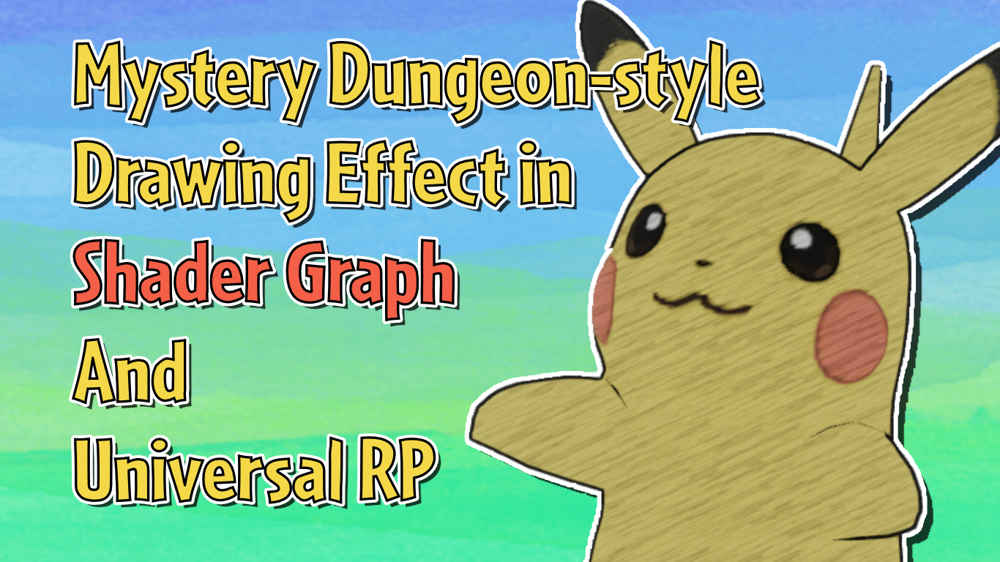

# Pokémon Mystery Dungeon-style Drawing Effect in Unity Shader Graph and URP

A drawing shader based loosely on Pokemon Mystery Dungeon: Rescue Team DX's art style.

## Overview

This project contains a shader graph for creating a sketching effect that is reminiscent of the art style of Pokémon Mystery Dungeon: Rescue Team DX. The effect is made up of an outline shader which uses the classic "flip faces, explode the mesh, render black" trick, and a separate shader which uses a drawing texture to make the object look like it's being sketched. An accompanying tutorial is available on [danielilett.com](https://danielilett.com/2020-10-09-tut5-11-urp-mystery-dungeon/).

## Software

This project was created using Unity 2019.4.0f1 and Universal Render Pipeline 7.3.1.

## Authors

This project and the corresponding tutorial series were written by Daniel Ilett. [Follow him on Twitter](https://twitter.com/daniel_ilett) for more gamedev tutorials and for the new Bitesize Gamedev series, which featured the outline shader!

## Release

This project was released on October 9th 2020.
